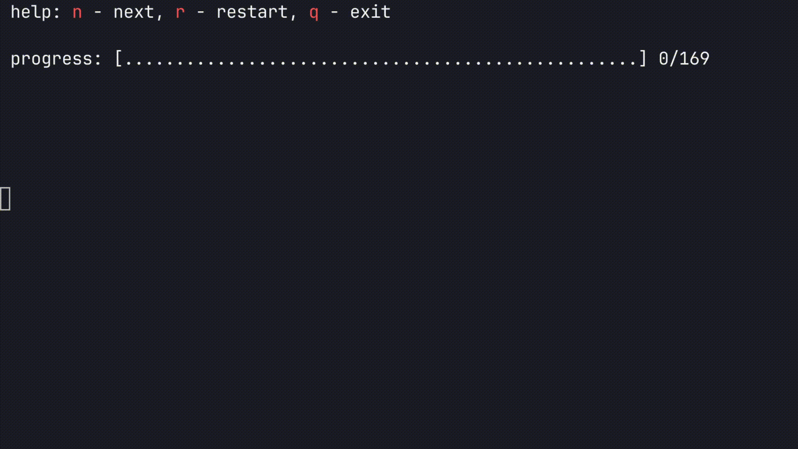

# Просмотр спусковых крючков для разгрузки мозга

Код написан на C, не содержит зависимостей и POSIX вызовов.
Должен компилироваться на любой платформе.



## Идея

Каждый сталкивался с проблемой возникновения тревожных мыслей по типу
"Я что-то забыл, но не помню что. А вдруг важное?". Попытки развеять
эту навязчивую тревогу зачастую ни к чему не приводят и тревога остается
с вами на протяжении дня, а может и дольше.

Спусковые крючки работают как **катализатор памяти**: глядя на темы
вы запускаете в голове ассоциации и вытаскиваете на поверхность вашу
тревогу/забытые задачи/отложенные задачи.

Например, если вы находитесь дома, то вас будут волновать вещи, которые
находятся внутри дома: уборка, готовка и прочее. Но глядя на тему
"машина - документы" вы сразу вспоминаете, что скоро истекает
страховка на машину.

## Билд

Билд требует `gcc` и `make` (`make` не обязателен, для удобства):
```bash
gcc --version
make --version
```
Если чего-то нет - установите:

```bash
# Ubuntu / Debian
sudo apt install gcc make

# Fedora / RHEL
sudo dnf install gcc make

# Arch
sudo pacman -S gcc make
```
Билд:

```bash
make
./main steps.md
```

## Формат файла источника

Форматирование вложенной структуры достигается за счёт `Markdown` форматирования - заголовков.
В `markdown` символ `#` позволяет создавать заголовки разной вложенности:
```markdown
# Заголовок 1 уровня
## Заголовок 2 уровня
### Заголовок 3 уровня
#### Заголовок 4 уровня
##### Заголовок 5 уровня
###### Заголовок 6 уровня
```
Они же позволят нам создавать вложенную структуру для крючков:
```markdown
# Дом
## Уборка
### Зал
### Кухня
### Туалет
## Документы
### Оплата счетов
### Переоформления
# Машина
## Документы
...
```
Для удобства я предпочитаю хранить их в `.md` файле: так они остаются читаемыми даже в репозитории.

Основной файл лежит [тут](./steps.md).
Другие примерны можно найти в [examples/](./examples/).


## Ссылки

- [Список Максима Дорофеева](https://gist.github.com/svetlyak40wt/6c79264d9c3615e1a168ed774fbc7335)
- [ANSI Escape Code](https://en.wikipedia.org/wiki/ANSI_escape_code)
